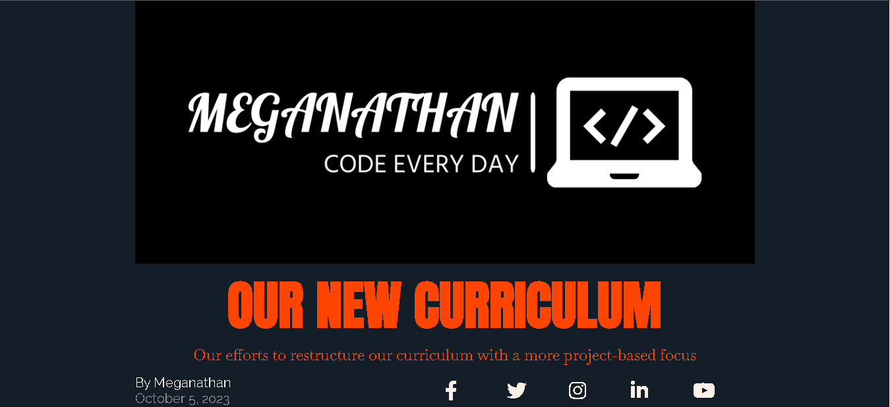
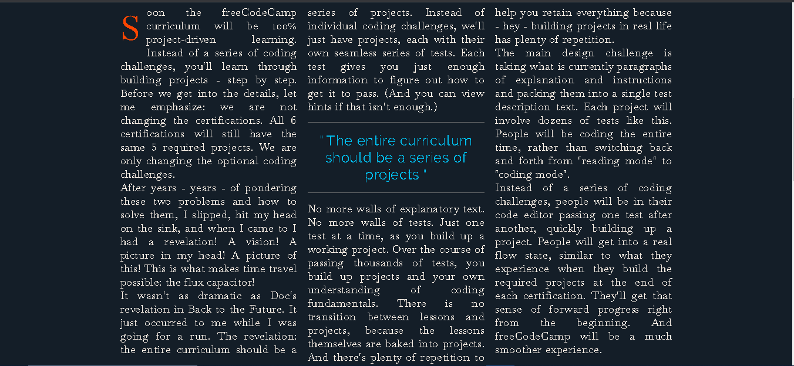
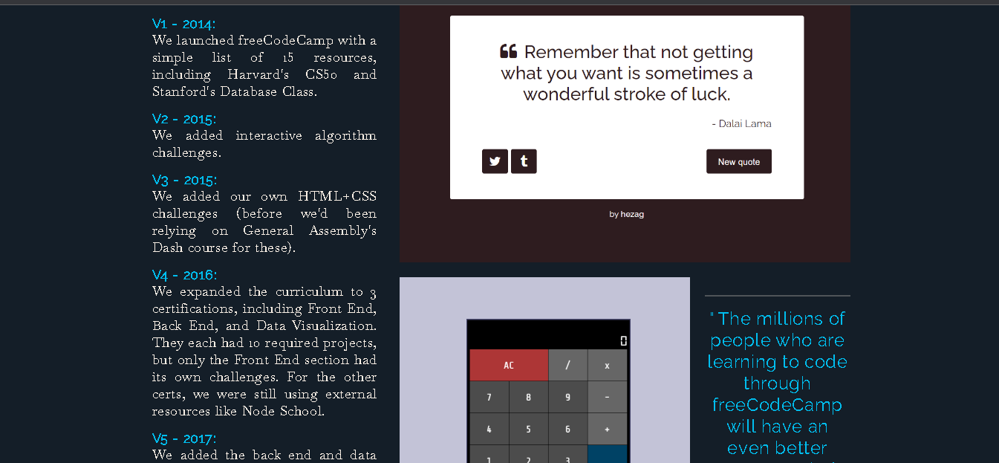

# Magazine Website

This is a sample magazine website created using HTML and CSS. The website features a modern and responsive design with a focus on typography and layout. 
It includes a hero section, article content, and a brief history section.




## Features

- Responsive design for various screen sizes.
- Hero section with a striking headline and author information.
- Article content with formatted text, images, and a blockquote.
- A brief history section with a timeline of the curriculum evolution.
- Stylish social media icons for sharing the content.
- Custom fonts and typography styles for an elegant look.

## Usage

You can view the live website by visiting [Demo]([https://your-demo-link.com](https://651e9a2b1547de0d249fe88e--verdant-kitsune-3d40b2.netlify.app/)).

To run this project locally:

1. Clone the repository:

   ```bash
   git clone https://github.com/yourusername/magazine-website.git
	```

2. Open the index.html file in your web browser to view the website.


##Customization

Feel free to customize the website by modifying the HTML and CSS files. You can change the content, fonts, colors, and styles to suit your preferences.

##Credits

Font Awesome - Icons used for social media links.
Google Fonts - Custom fonts used in the project.
freeCodeCamp - make this project with help of freeCodeCamp.

##Author

For E-mail: mmeganatha827@gmail.com
